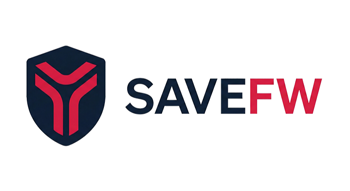
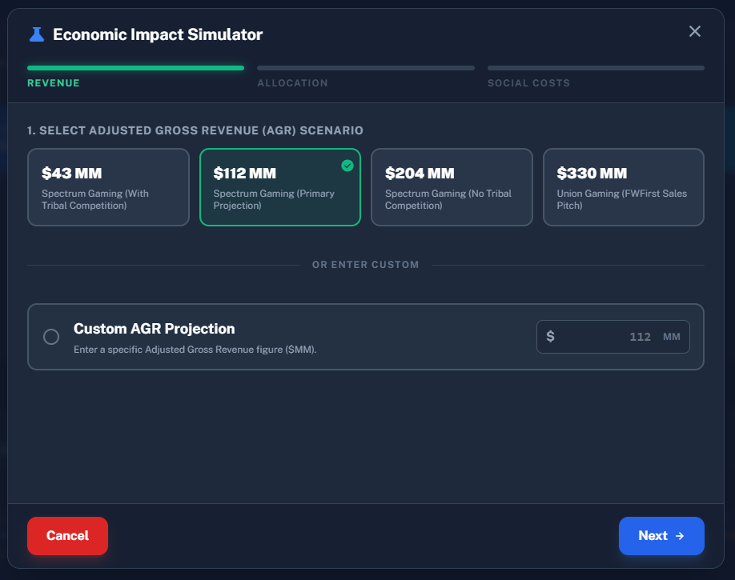
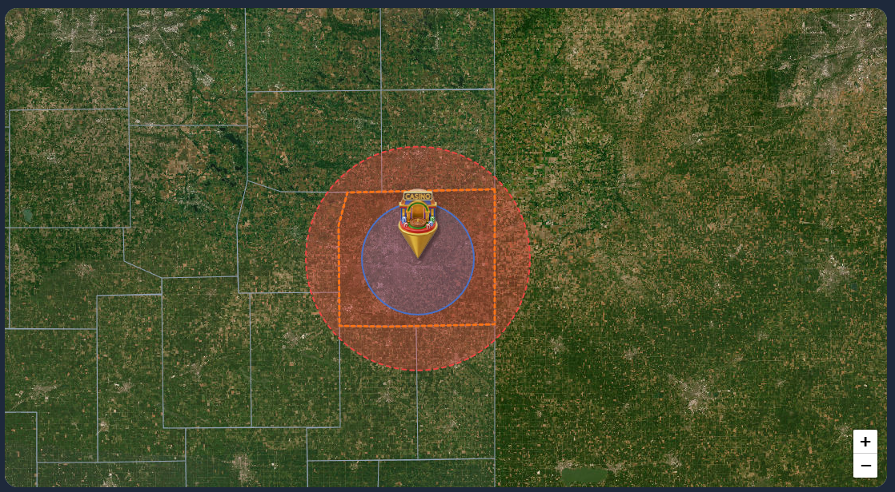

<div align="center">

  <picture>
    
  </picture>

  # Save Fort Wayne
  ### Protect Our Future

  <p>
    A data-driven, grassroots platform exposing the hidden economic and social costs of proposed casino expansions.
  </p>

  <br />

  <p>
    <a href="https://dotnet.microsoft.com/"></a>
    <a href="https://learn.microsoft.com/en-us/dotnet/csharp/"></a>
    <a href="https://dotnet.microsoft.com/apps/aspnet/web-apps/blazor"></a>
    <a href="https://www.postgresql.org/"></a>
    <a href="https://postgis.net/"></a>
    <a href="https://github.com/valhalla/valhalla"></a>
    <a href="https://cloudbeaver.io/"></a>
    <a href="https://learn.microsoft.com/en-us/dotnet/core/extensions/workers"></a>
    <a href="https://tailwindcss.com/"></a>
    <a href="https://www.docker.com/"></a>
    <a href="https://maplibre.org/"></a>
  </p>

</div>

<br />

---

## Project Overview

Save Fort Wayne is an interactive open-source platform designed to educate citizens, policymakers, and researchers. It provides deterministic financial modeling and geospatial analysis regarding casino impacts on community character and fiscal health.

### Core Objectives
*   **Public Education:** Uncover documented social costs including addiction, crime, and wealth extraction.
*   **Data Transparency:** Provide interactive modeling tools to visualize community deficits and providing the data to the public as an open source project (AGPL-3.0 license) to allow for community contribution and collaboration.
*   **Policy Critique:** Refute marketing claims with independent studies and empirical data.
*   **Advocacy:** Mobilize the community to demand a public referendum, which has been the historical precedent for other Indiana areas.

---

## Repository Structure

```text
📁 SaveFW
├── 📁 infra              # Infrastructure Configuration
│   └── 📁 valhalla       # Valhalla Routing Engine Config & Tiles
├── 📁 SaveFW.Client      # Blazor WebAssembly Frontend
│   ├── 📁 Pages          # Razor Components (Hero, Map, Calculator)
│   └── 📁 wwwroot        # Static assets and modular JS files
├── 📁 SaveFW.Server      # .NET 10 Web API Backend
│   ├── 📁 Data           # DbContext and PostgreSQL Seeding Logic
│   └── 📄 Program.cs     # API Routing and Blazor Hosting
├── 📁 SaveFW.Shared      # Shared C# Class Library
│   └── 📄 Legislator.cs  # Shared Data Models
├── 📁 SaveFW.Worker      # Background Service (Batch Scoring)
│   └── 📄 Worker.cs      # Grid Generation & Valhalla Integration
├── 📁 docs               # Documentation Assets
│   └── 📄 logo.svg       # Project Logo
├── 📄 docker-compose.yml # Orchestration (App, DB, Valhalla, CloudBeaver)
├── 📄 Dockerfile         # Multi-stage build for .NET 10
└── 📄 SaveFW.sln         # Visual Studio Solution
```

---

# Key Features

## Economic Impact Calculator
The core of the platform is an interactive financial model that allows citizens to audit the "net benefit" claims made by developers. Users can adjust critical variables—including Adjusted Gross Revenue (AGR), tax revenue allocation strategies, and social cost multipliers—to calculate the true projected community deficit. Unlike static reports, this tool recalculates in real-time, showing how even optimistic revenue projections often fail to cover the public sector costs of addiction and crime. This transparency is vital for ensuring that the community isn't left with a multi-decade fiscal burden.
<br /><br />

## Programmatic Economic Analysis
Moving beyond "AI estimates" or "black box" consulting studies, SaveFW employs a deterministic, rule-based analysis. This system processes user inputs against fixed mathematical formulas derived from peer-reviewed economic literature (Grinols, Welte, et al.). By basing the logic on established academic precedents, the platform ensures that every result is reproducible, transparent, and mathematically verifiable. This provides a "Programmatic Fact Check" that updates instantly as variables change, removing human bias from the calculation.
<br /><br />

## Economic Impact Simulator
For users who want to explore "What If" scenarios, the Simulator provides a guided wizard. It allows users to rapidly toggle between the State's conservative revenue estimates ($43M-$112M) and the Developer's sales pitch ($330M), applying varying degrees of social cost sensitivity to see if *any* scenario results in a net positive for the taxpayer. This helps demonstrate that the "economic engine" promised by promoters is often a mathematical impossibility when accounting for the predictable rise in local social expenditures.
<br /><br />

<br /><br />

## Interactive Slot Machine
A visual metaphor for the marketing strategies used to sell the casino project. The digital slot machine demonstrates the "Near Miss" psychological effect—where "JOBS" appears just one click away from "ADDICTION"—highlighting how promises of economic prosperity are often just a mechanism for revenue generation. This tool is designed to educate the public on the intentional design of gambling environments and their linguistic framing in political discourse.
<br /><br />

## Impact Zone Visualizer
This MapLibre GL JS-based geospatial tool visualizes the geographic scope of problem gambling using standard radius zones (0-10 miles for high risk, 10-20 miles for elevated risk). Work is underway to integrate **Valhalla** to generate precise drive-time polygons (isochrones). Future updates will transition to a **1-hour drive time** impact zone, widely cited in academic literature (Grinols, 2011 & 2016) as the primary catchment area for local problem gambling prevalence.
<br /><br />

<br /><br />

## Analyzing the Claims
A direct, side-by-side comparison of the marketing claims ("Economic Engine," "World-Class Destination") versus the documented reality found in similar markets ("Substitution Effect," "Market Saturation"). This section uses a "Claim vs. Reality" format, supported by direct links to independent studies and government data, to help citizens see past the promotional campaigns and understand the systemic risks.

## Detailed Demographics
The platform integrates granular population data for all 92 Indiana counties, allowing the impact model to be applied specifically to the local demographics of Allen County and its neighbors. This ensures that the analysis isn't just a generic statewide average, but a tailored report based on the specific socio-economic profile of the affected region.

---

# Architecture

This project is built using a modern .NET 10 distributed architecture:

*   **Backend:** .NET 10 Web API utilizing Entity Framework Core.
*   **Worker:** Background service for heavy geospatial processing (grid generation, scoring).
*   **Frontend:** Blazor WebAssembly styled with Tailwind CSS.
*   **Database:** PostgreSQL 18 + PostGIS (Dockerized) with automated data seeding.
*   **Routing:** Self-hosted Valhalla engine for offline isochrone generation.
*   **Management:** CloudBeaver for web-based database administration.
*   **Maps:** MapLibre GL JS with Protomaps PMTiles for offline vector maps.
*   **Deployment:** Fully containerized environment via Docker Compose.

---

# Installation

The easiest way to run Save Fort Wayne is using **Docker**. This ensures the application, database, and all dependencies run exactly as intended without installing anything else on your machine.

## System Requirements

This project now includes a **Valhalla** routing engine for offline isochrone generation. This adds specific hardware requirements, particularly during the initial graph build process.

| Resource | Minimum | Recommended | Notes |
| :--- | :--- | :--- | :--- |
| **RAM** | 8 GB | 16 GB | **Crucial:** Valhalla needs ~8-10GB RAM to "cook" the graph tiles for the 5-state Midwest region. Runtime usage is lower (~4GB). |
| **CPU** | 4 Cores | 8+ Cores | Build is CPU-intensive but runs once. Runtime scaling depends on request volume. |
| **Storage** | 20 GB | 100 GB | Graph tiles and PBF files consume ~10-15GB. 100GB is recommended for a stable server environment. |

**Note for Proxmox/Container Users:**
If running in a container (LXC/Docker), ensure you have allocated at least **10GB RAM** for the initial build. You may scale this down to **4-6GB** once the `custom_files/valhalla_tiles.tar` has been generated, as the runtime engine uses memory mapping.

---

## 1. Prerequisites

You only need **Docker** installed.

<details>
<summary><strong>Click here for Docker Installation Instructions</strong></summary>

## Windows
1. Download [Docker Desktop for Windows](https://desktop.docker.com/win/main/amd64/Docker%20Desktop%20Installer.exe).
2. Run the installer and follow the on-screen instructions.
3. Restart your computer if prompted.
4. Open PowerShell and verify by running: `docker --version`

## macOS
1. Download [Docker Desktop for Mac](https://docs.docker.com/desktop/install/mac-install/).
   - [Apple Silicon (M1/M2/M3)](https://desktop.docker.com/mac/main/arm64/Docker.dmg)
   - [Intel Chip](https://desktop.docker.com/mac/main/amd64/Docker.dmg)
2. Drag the Docker icon to your Applications folder.
3. Open Docker from Applications.
4. Open Terminal and verify by running: `docker --version`

## Linux (Ubuntu/Debian)
Run the convenience script to install Docker Engine:
```bash
curl -fsSL https://get.docker.com -o get-docker.sh
sudo sh get-docker.sh
```
Verify installation: `docker --version`

</details>

## 2. Run the Application

Once **Docker** is installed, simply clone the repo and start the containers. The repository handles everything else (database setup, data seeding, dependencies).

```bash
# 1. Clone the repository
git clone https://github.com/savefw/casino-economic-impact-calculator.git
cd casino-economic-impact-calculator/SaveFW

# 2. Start the application
docker compose up --build -d
```

The application is now running! Access the services at:

| Service | URL | Description |
| :--- | :--- | :--- |
| **Production Web Application** | **http://localhost:80** | Main user interface |
| **Development Web Application** | **http://localhost:5000** | Main user interface |
| **CloudBeaver** | **http://localhost:8978** | Database GUI Management |
| **Valhalla API** | **http://localhost:8002** | Isochrone & Routing API |

---

## For Developers (Optional)

If you wish to modify the C# code or run the application without Docker, you will need the [.NET 10 SDK](https://dotnet.microsoft.com/download).

```bash
# Local Development Command
# This will start the dev server on port 5000 to avoid conflicting with port 80 (Docker).
# Ensure Valhalla is available (standard port 8002 for Docker, or 8003 for Dev).
export PATH=$PATH:/root/.dotnet
cd SaveFW
./dev/start_server.sh
```

## Dependencies & Offline Support

This application is designed to run **fully offline**. All critical external assets—including CSS frameworks, JavaScript libraries, Fonts, and Map Tiles—have been localized or vendored to ensure zero dependency on external CDNs during runtime. This architecture guarantees stability, privacy, and performance even in isolated environments.

### NPM Packages (Frontend)
Managed via `package.json` and built using `npm run build:css` / `copy-libs`.

| Package | Version | Purpose |
| :--- | :--- | :--- |
| **tailwindcss** | ^3.4.0 | Utility-first CSS framework (Built via CLI) |
| **@turf/turf** | ^7.3.1 | Geospatial analysis engine (Client-side) |
| **chart.js** | ^4.5.1 | Interactive charts and graphs |
| **html2canvas** | ^1.4.1 | Canvas generation for PDF reports |
| **terra-draw** | ^1.22.0 | Map drawing primitives and adapter |
| **@fontsource-variable/public-sans** | ^5.2.7 | Typography (Variable Font) |
| **@fontsource-variable/material-symbols-outlined** | ^5.2.30 | Iconography (Variable Font) |

### .NET Packages (Server)
Managed via NuGet in `SaveFW.Server.csproj`.

| Package | Version | Purpose |
| :--- | :--- | :--- |
| **Npgsql.EntityFrameworkCore.PostgreSQL** | 10.0.0 | Database Provider for PostgreSQL |
| **Npgsql.EntityFrameworkCore.PostgreSQL.NetTopologySuite** | 10.0.0 | Spatial Support (PostGIS) |
| **NetTopologySuite.IO.ShapeFile** | 2.1.0 | SHP File Ingestion (Census Data) |
| **NetTopologySuite.IO.Esri.Shapefile** | 1.2.0 | Extended Shapefile Support |
| **QuestPDF** | 2025.12.1 | PDF Report Generation |
| **Microsoft.AspNetCore.Components.WebAssembly.Server** | 10.0.1 | Blazor Server Hosting |
| **Microsoft.EntityFrameworkCore.Design** | 10.0.1 | EF Core Migration Tooling |
| **Microsoft.AspNetCore.OpenApi** | 9.0.11 | Swagger/OpenAPI Generation |

### Vendored Libraries
These libraries are manually included in `wwwroot/js/lib` or `wwwroot/css` to avoid external fetch requests.

| Library | Version | Purpose |
| :--- | :--- | :--- |
| **MapLibre GL JS** | v4.x | GPU-accelerated vector maps |
| **PMTiles.js** | v2.x | Offline vector tile protocol for Protomaps |
| **PDF.js** | v3.x | Client-side PDF rendering |
| **PageFlip** | v2.x | Flipbook animation effect |

---

# Open Source and Contributions

This project is shared openly to encourage community involvement. We invite developers and data scientists to:

1.  Improve the Calculator: Refine social cost algorithms and add granular data points.
2.  Enhance Visualizations: Expand mapping and charting capabilities.
3.  Audit Sources: Ensure the latest research is reflected in the platform models.

# Contact

For inquiries, feedback, or to join the coalition, please reach out to:
outreach@savefw.com

# Data and Sources

Social cost modeling is derived from established academic research:
*   Grinols (2011): Social cost per problem gambler calculations (adjusted for 2025 inflation).
*   Welte et al.: Proximity-based multipliers for gambling addiction risk.
*   Spectrum Gaming: Comparison of state-commissioned revenue projections.

---

<div align="center">
  <p><em>A volunteer effort by concerned residents of Allen County.</em></p>
  <p>
    <a href="https://savefw.com"><strong>Visit Live Site</strong></a>
  </p>
</div>